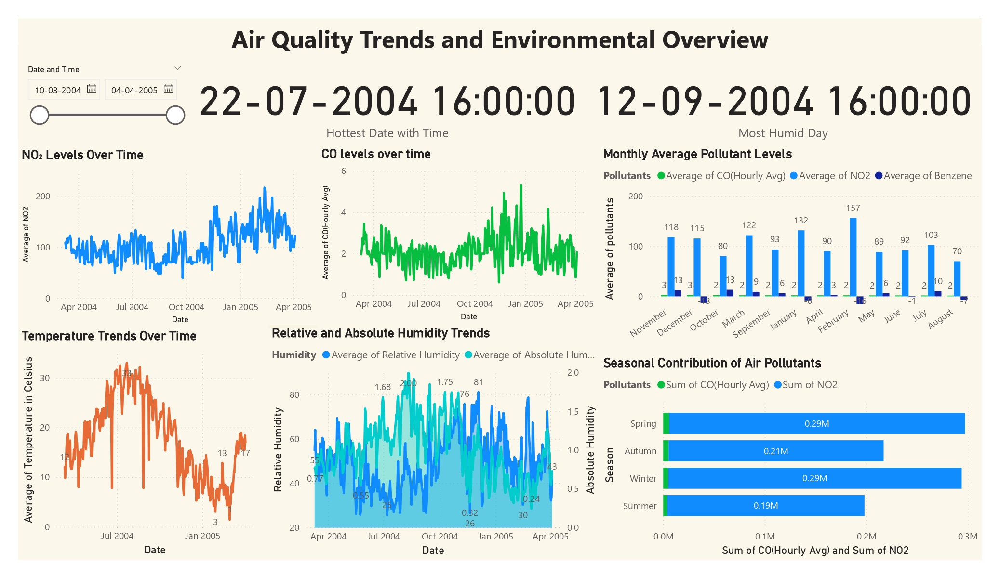
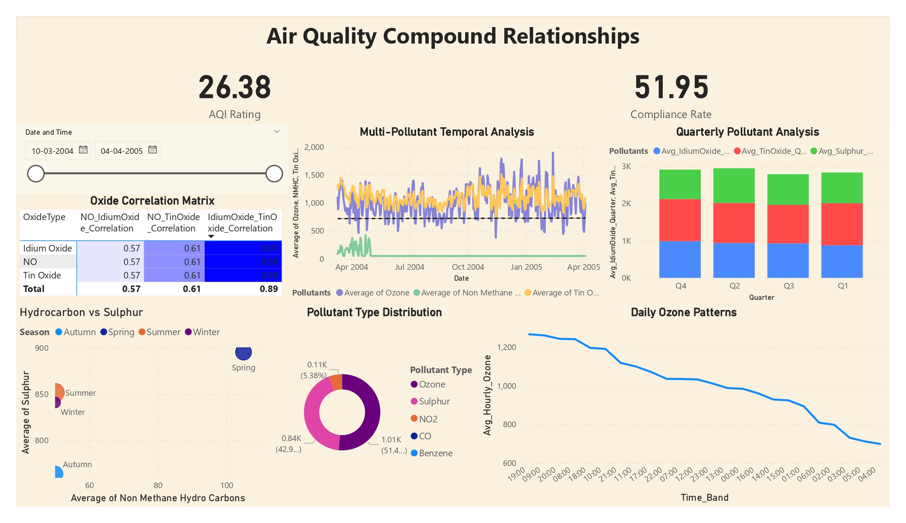

# Air Quality Analytics Dashboard

## Overview
Comprehensive air quality analysis project featuring two interconnected dashboards:
- Primary Environmental Metrics
- Advanced Compound Relations

## Features
- Real-time air quality monitoring
- Pollutant correlation analysis
- Temporal pattern recognition
- Seasonal trend analysis
- Advanced compound relationship visualization

## Dashboards

1. **Primary Environmental Metrics Dashboard**
   
- NO₂ and CO level tracking
- Temperature trends
- Humidity analysis
- Seasonal pollutant contribution

### 2. Advanced Compound Relations

- Oxide correlation matrix
- Hydrocarbon vs. Sulphur analysis
- Daily ozone patterns
- Quarterly pollutant analysis

## Tech Stack
- Power BI
- DAX
- Excel

## Data Source
UCI Air Quality Dataset containing hourly averaged responses from an array of gas sensors.

## Key Insights
- Strong correlation between Idium Oxide and Tin Oxide (0.89)
- Seasonal variations in pollutant levels
- Peak pollution periods identified
- Temperature impact on concentration levels

## Documentation
- [DAX Guide](docs/Dax_Documentation_guide.pdf)
- [Business Case Study](images/Beijing_Air_Quality_Presentation_by_Venkata_Akhil_Mettu.pptx)

## Installation & Setup
1. Clone repository
2. Open .pbix files in Power BI Desktop
3. Connect to data source
4. Refresh data

## Business Impact
- Enhanced monitoring capabilities
- Improved decision-making framework
- Better prediction of pollutant behaviors
- Risk management optimization

## Contributing
Feel free to submit issues and enhancement requests.

## Contact
Venkata Akhil Mettu

venkatakhil149@gmail.com
